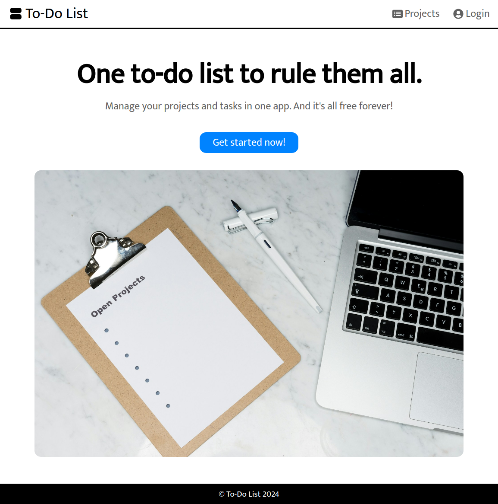
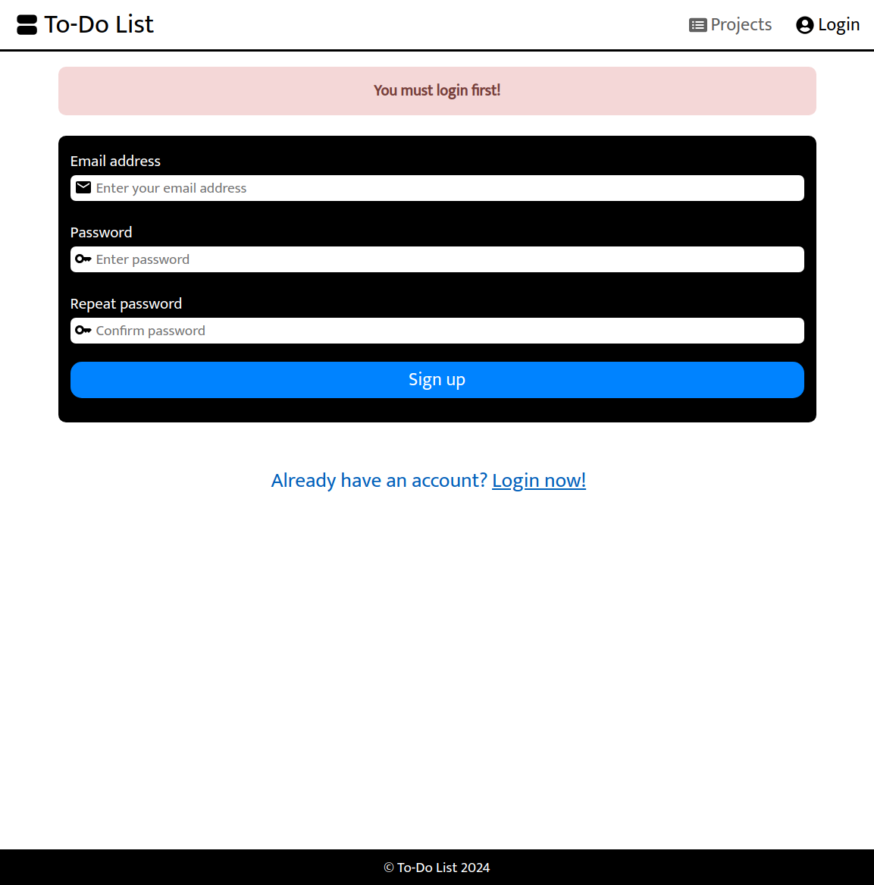
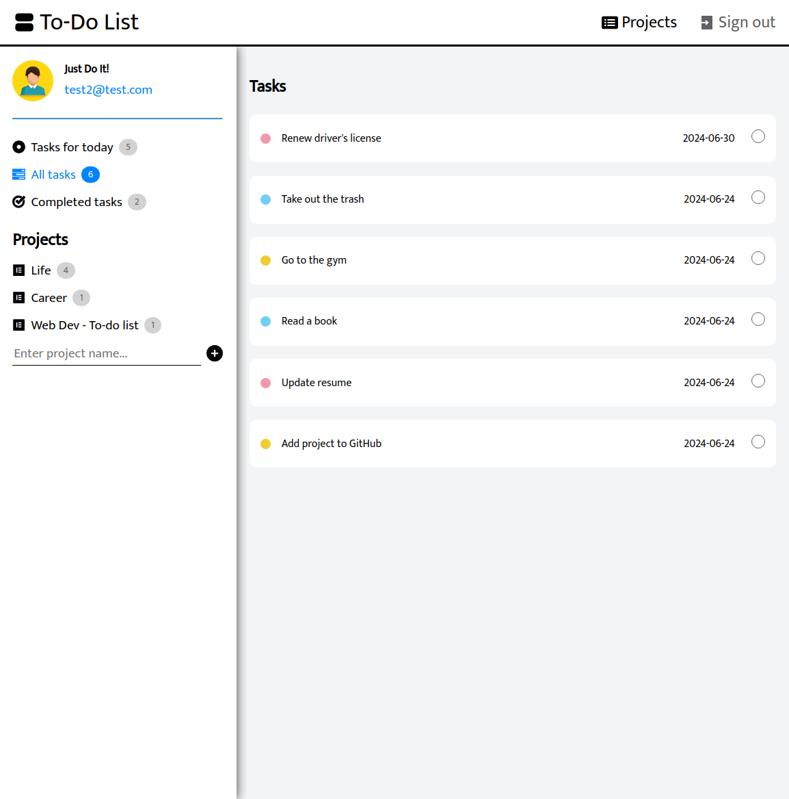
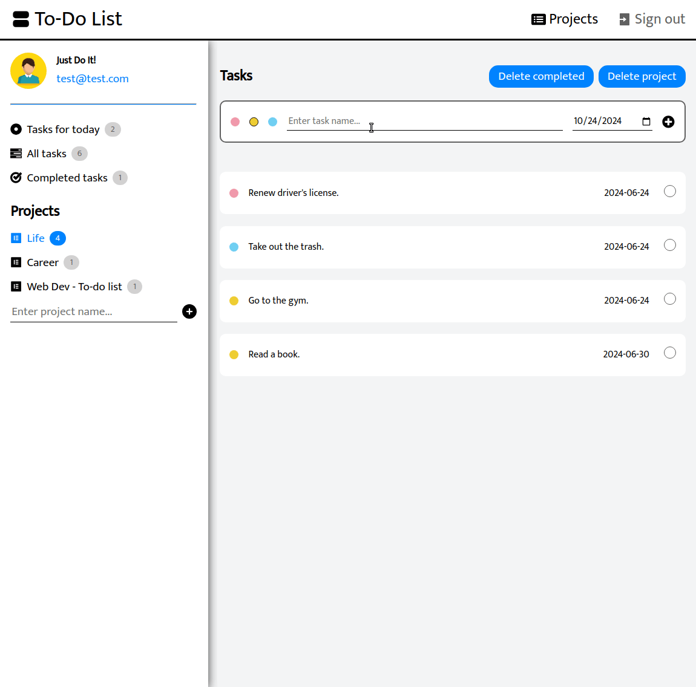
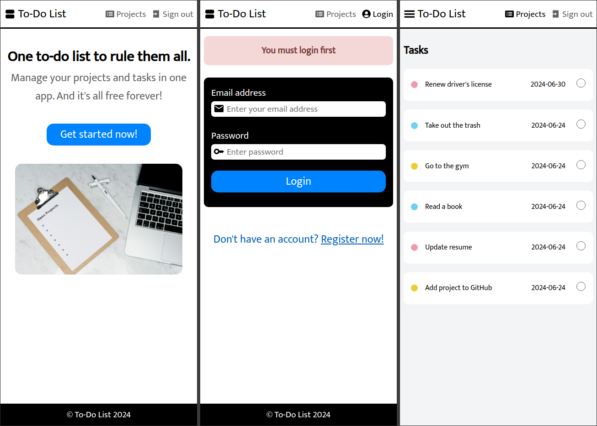
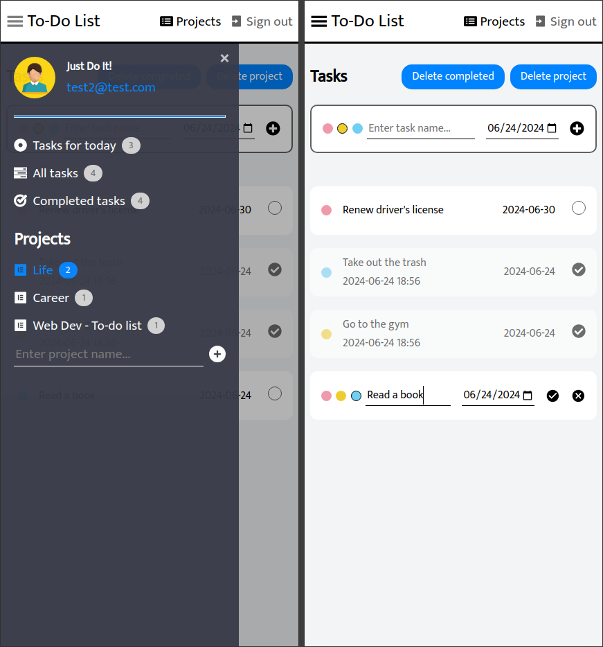

# React Project: To-Do List

The goal of this project was to create a to-do list app. The user can create projects and add tasks to them after registering an account. Each project acts as separate to-do list. I've originally done a similar project in Vanilla JS as part of The Odin Project course. In this one I used React instead and made code more readable, added support for routes, improved styling and added Firebase backend for authentication and database features. 

I started and finished this project in June 2024.

## Technology

- React
- React Router v6
- JavaScript
- CSS
- Vite
- Firebase

## Key Concepts

- Multi-page and single-page apps
- Client-side routing
- BrowserRouter & Routes: createBrowserRouter(), createRoutesFromElements() & RouterProvider
- Route, path & element
- Layout Route & Outlet
- Protected routes
- Link & NavLink: navigation, active styling, state & useLocation()
- Firebase: Authentication, Firestore database, syncing data; adding, deleting and updating data
- useEffect: side effects, syntax, dependencies array, async functions, subscriptions & cleaning functions
- Context: useContext, createContext, context provider, passing values

## Features

- The user can create a new account or log in to an existing one.
- The user can create projects and add tasks to them. 
- The user can remove projects or completed tasks.
- Tasks can be edited or marked as completed. 
- Hamburger menu for tablet & mobile. I used this library to add this feature: https://github.com/negomi/react-burger-menu

## Test account

- email: test@test.com
- password: 123456

## Links

[Live Demo](https://bn7631-todo-list-new.pages.dev)

## Screenshots

### Desktop









### Mobile





## Sources

- https://unsplash.com/photos/Q2J2qQsoYH8 by Markus Winkler
- <a href="https://www.freepik.com/free-vector/businessman-character-avatar-isolated_6769264.htm">Image by studiogstock</a> on Freepik
- https://fonts.google.com/specimen/Mukta

## Deployment

```bash
# clone repo
git clone https://github.com/BrightNeon7631/todo-list-firebase.git

# install project dependencies
npm install

# run vite dev server
npm run dev

# create a production build
npm run build
```
